# Introduction to Unity

This session introduces Unity and how to create a new project and begin using it:   

1 Installing Unity Hub and creating a project. 
2 Intro to the interface   
2.1 Creating a scene   
3 Navigating the scene. 
4 Game objects and components   
5 Customising the UI.   
6 File management and organisation.  
7 Prefabs, importing assets and the package manager.  
8 Setting a camera view.   
9 Adding a first person character controller.   
10 Adding a third person character controller.  
11 Adding a Mixano character to a third person character controller.   

## 1. Installing Unity Hub and creating a project

[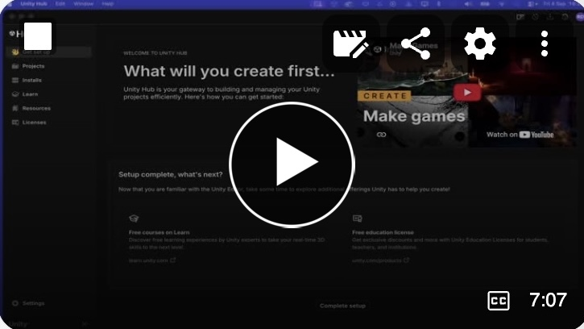](https://uwe.cloud.panopto.eu/Panopto/Pages/Viewer.aspx?id=b9b86879-e546-4a35-b9da-b4bb00fe3606)  

Always check the console (see image below) for errors when you first open your install and whilst you are creating / making changes projects.  Errors will prevent you project from running, so need to be fixed as soon as you see them.   
Errors are red, as below. Warnings are orange (warning will not prevent your project from running, but you might still want to fix them).

I had the errors below on install. Restarting the project from Hub (see video above) cleared them.
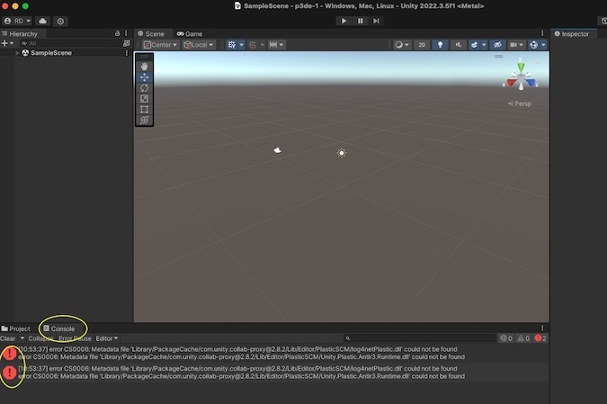

## 2 Intro to the interface 
[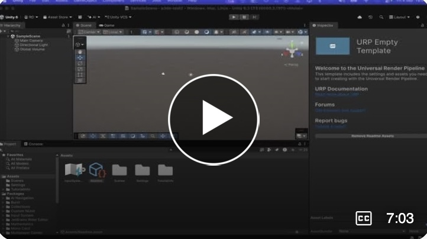](https://uwe.cloud.panopto.eu/Panopto/Pages/Viewer.aspx?id=a3de966e-2f12-464e-99bc-b4bb01057177)

## 2.1 Creating a scene 
[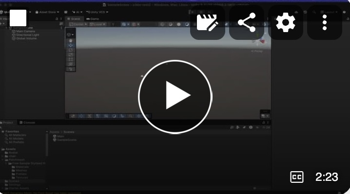](https://uwe.cloud.panopto.eu/Panopto/Pages/Viewer.aspx?id=4c4aa864-c28b-4120-bc4c-b4be00afbc4e)

## 3 Navigating the scene
[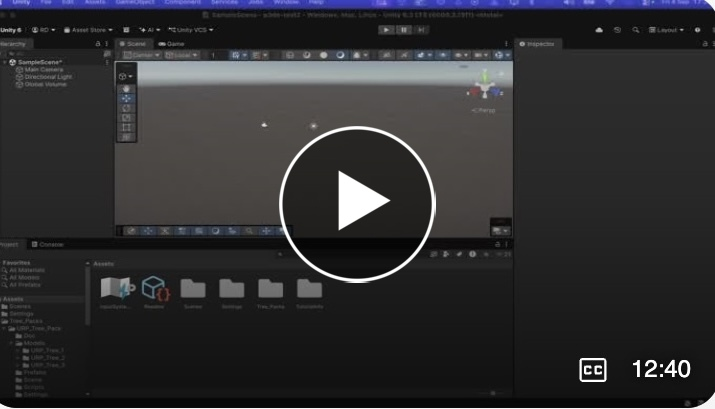](https://uwe.cloud.panopto.eu/Panopto/Pages/Viewer.aspx?id=0ccfe341-2470-4065-bfd8-b4bb010feee3)

## 4 Game objects and components
[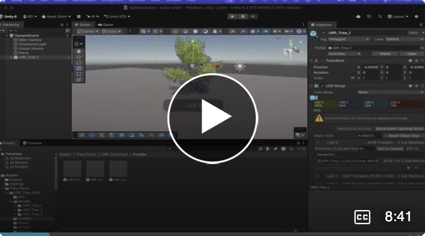](https://uwe.cloud.panopto.eu/Panopto/Pages/Viewer.aspx?id=8baaf1fa-0584-467d-be83-b4bb0116769c)

## 5 Customising the UI
[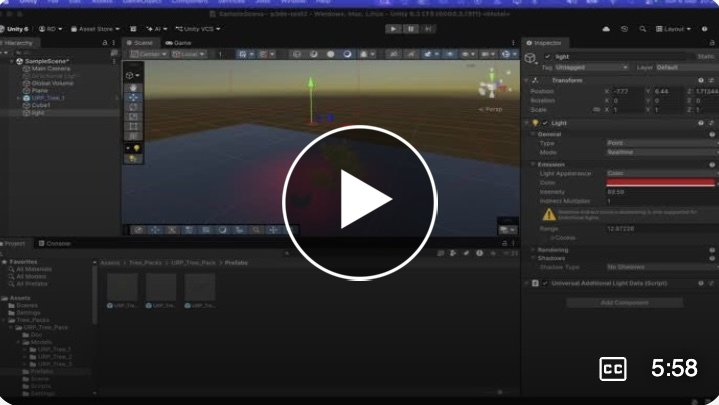](https://uwe.cloud.panopto.eu/Panopto/Pages/Viewer.aspx?id=31a827d4-96b2-4b0d-9cff-b4bd01405e04)

## 6 File management and organisation
[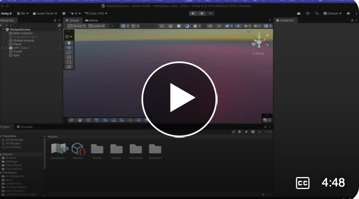](https://uwe.cloud.panopto.eu/Panopto/Pages/Viewer.aspx?id=9e7ace84-d967-49e3-b073-b4bd01472d6a)

## 7 Prefabs, importing assets and the package manager

## 8 Setting a camera view
[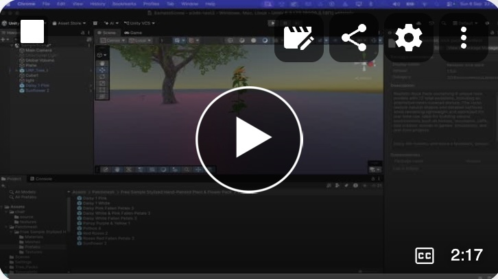](https://uwe.cloud.panopto.eu/Panopto/Pages/Viewer.aspx?id=953564d5-de75-479e-b10e-b4bd0162a302)

## 9 Adding a first person character controller

## 10 Adding a third person character controller
[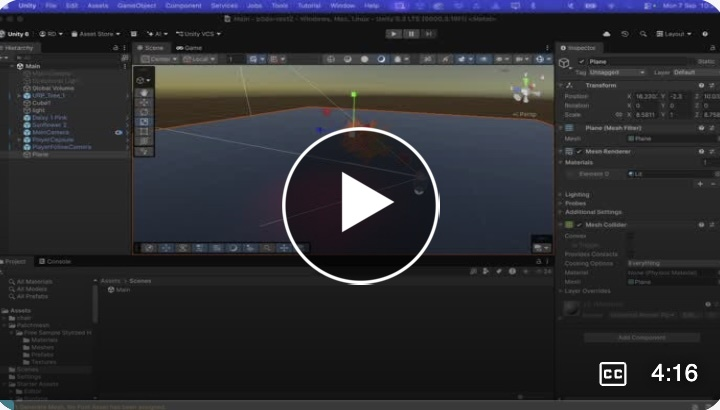](https://uwe.cloud.panopto.eu/Panopto/Pages/Viewer.aspx?id=b29d9c6b-5eb5-4037-87f6-b4be009cd5f0)

## 11 Adding a Mixano character to a third person character controller
[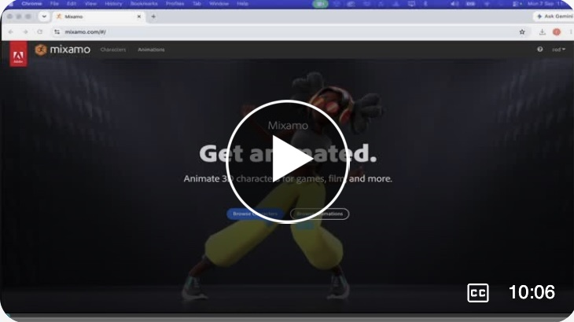](https://uwe.cloud.panopto.eu/Panopto/Pages/Viewer.aspx?id=b46a9f44-66c6-4908-9750-b4be00a862a1)

