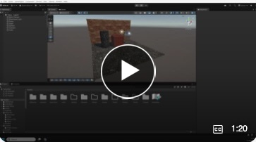
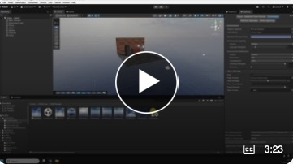
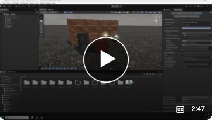

# Introduction to Lighting in Unity

These videos step through the basic ways you can light your scene.

1. Intro to background and ambient light, global illumination, reflections and a configurable skybox.   
2. Skyboxes and the lighting panel
3. Using fog    

## 1. Intro to background and ambient light, global illumination, reflections and a configurable skybox.   
  

## 2 Skyboxes and the lighting panel

## 3 Using fog  

