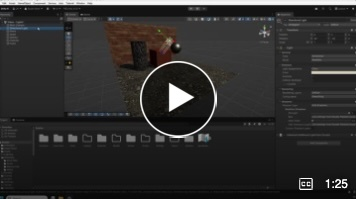
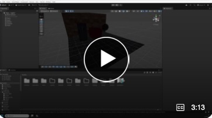
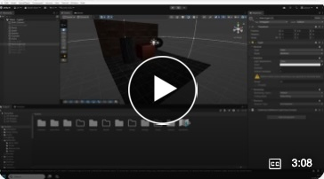

# Introduction to Lighting in Unity

These videos step through the basic ways you can light your scene.

1. Introduction to point, spot and directional lights.   
2. Light properties including shadows
3. Light properties including intensity   

## 1. Introduction to point, spot and directional lights.   
  

## 2 Light properties including shadows

## 3 Light properties including intensity

