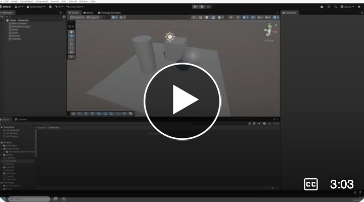
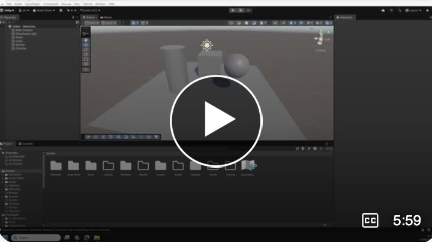
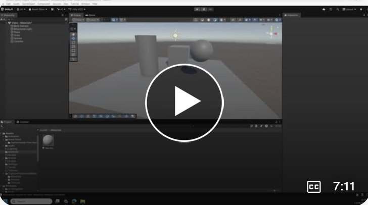
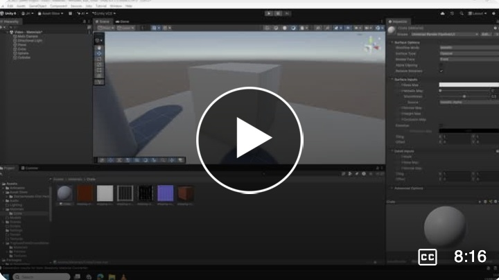

# Introduction to Materials in Unity

These videos step through the basic ways you can set up and use materials to texture assets in Unity

1. Creating a Material.   
2. Downloading and using materials
3. Material properties, including transparency   
4. Adding texture maps to a material.    

## 1. Creating a Material.   
  

## 2 Downloading and using materials

## 3 Material properties, including transparency

## 4 Adding texture maps to a material.

