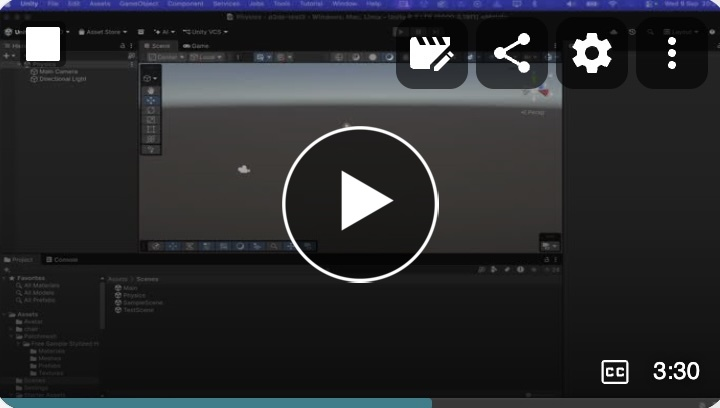
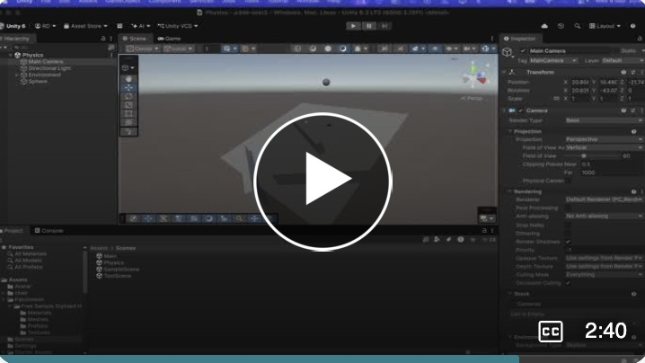
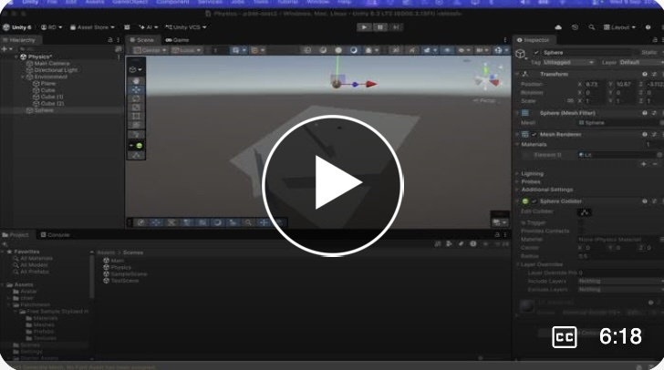
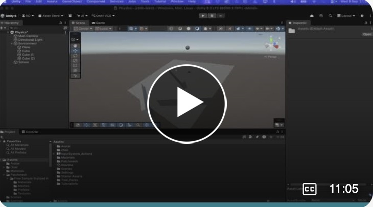
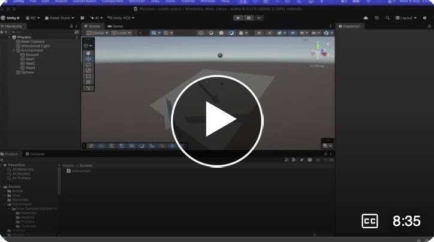
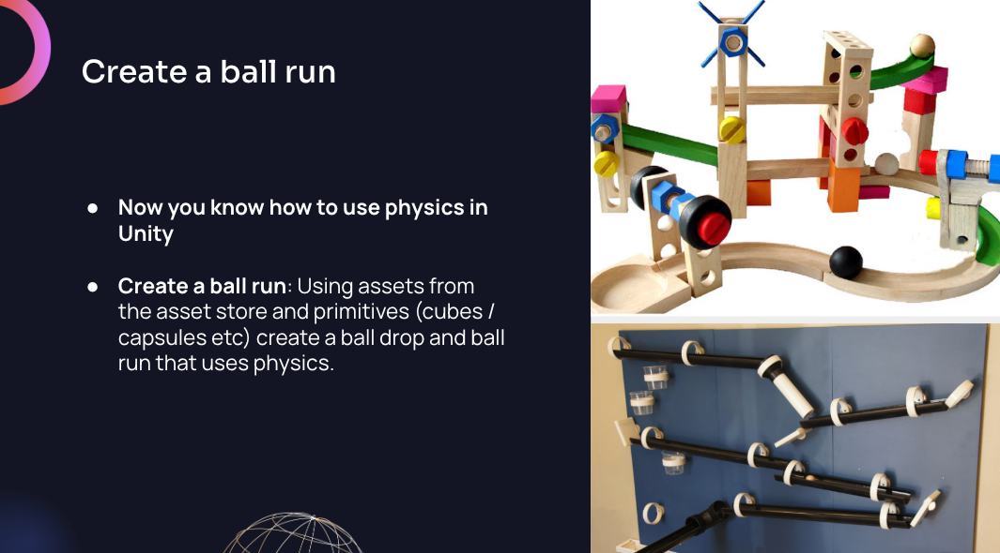

# Introduction to Physics in Unity

These videos step through the basic ways you can set up and use the physics environment in Unity

1. Set up.   
2. Explanation
3. Rigidbodies and physics properties   
4. Capturing collisions with a script
5. Trigger areas.    
6. Put all this knowledge together to create a ball run exercise.

## 1. Set up
  

## 2 Explanation

## 3 Rigidbodies and physics properties

## 4 Capturing collisions with a script

## 5 Trigger areas

## 6 Exercise: Create a ball run

Create a ball run!   

Download the assets below and use this and other assets from the Asset store.  

Download a selection of tubes and curves for your ball run.    
[tubes.zip](./assets/tubes.zip)

