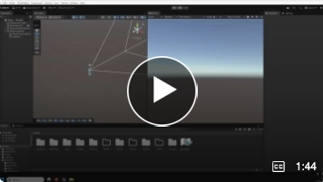
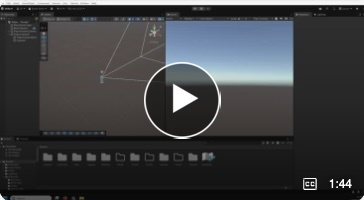
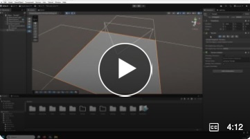

# Introduction to Greyboxing in Unity

In 3D production, often creating a simplified version of an environment before we start working with assets or producing is part of the workflow. 
This is called greyboxing. Using simple primitive objects: cubes, cylinder, planes to block out a scene.

## This video demonstration will show you how to block out a scene.
  

# Introduction to Terrain in Unity.  
In the previous video, I demonstrated how to block out an environment on a flat plane. When working with 3D environments, however, sometimes working on a flat plane is not suitable, for example when producing outdoor, rugged or natural areas. In these demonstrations, I'll show you how to use the Unity Terrain Tool,

1. Introduction to the Terrain tool.   
2. Creating terrain

## 1 Introduction to the Terrain tool

## 2 Creating terrain

