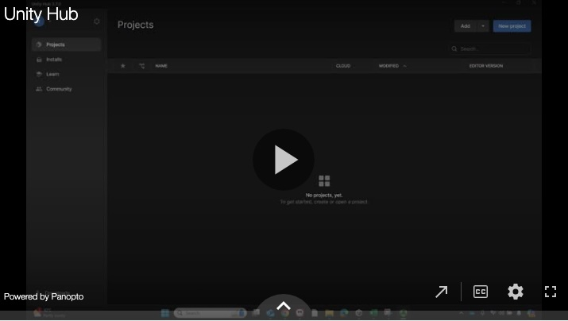
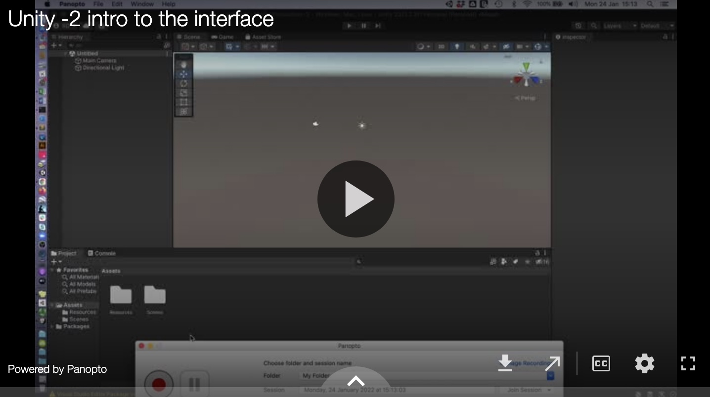

# Introduction to Unity

This session introduces Unity and how to create a new project and begin using it:   

1 Installing Unity Hub and creating a project   
2 Intro to the interface    
3 Navigating the scene   
4 Game objects and components   
5 Customising the UI    
6 File management and organisation   
7 Package manager and importing assets   
8 Setting a camera view  
9 First person character  

## 1. Installing Unity Hub and creating a project

## 2 Intro to the interface 

